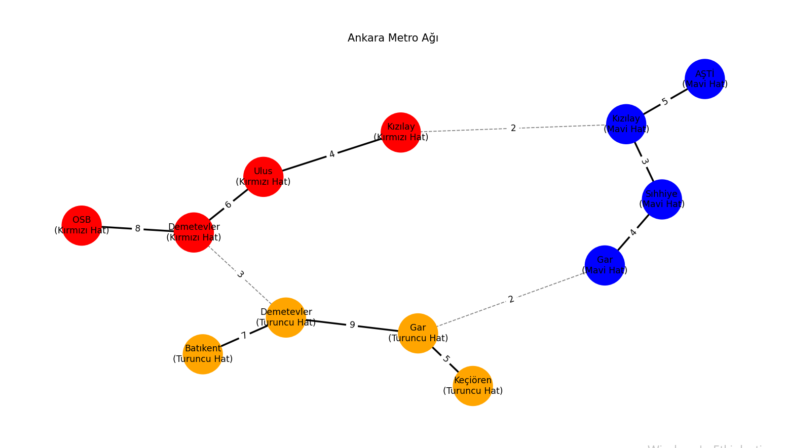
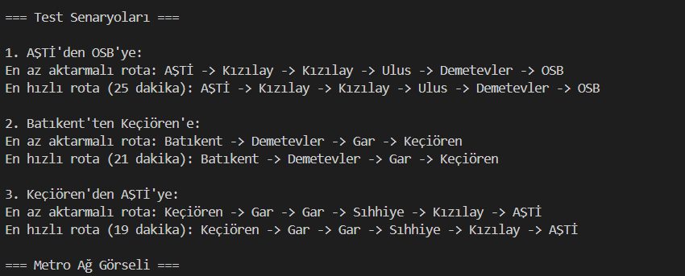

# 🚇 Sürücüsüz Metro Simülasyonu - Rota Optimizasyonu


Bu proje, bir metro ağında *en hızlı* ve *en az aktarmalı* rotaları bulan bir simülasyon sistemidir. Graf teorisi ve optimizasyon algoritmaları kullanılarak geliştirilmiştir.

---

## 📜 İçindekiler
- [Proje Tanımı](#-proje-tanımı)
- [Kullanılan Teknolojiler](#-kullanılan-teknolojiler)
- [Algoritma Detayları](#-algoritma-detayları)
- [Grafiksel Görselleştirme](#-grafiksel-görselleştirme)
- [Kurulum](#-kurulum)
- [Örnek Senaryolar](#-örnek-senaryolar)

---

## 🎯 Proje Tanımı
Bu proje, aşağıdaki özellikleri içerir:
- En Az Aktarmalı Rota (BFS Algoritması)
- En Hızlı Rota (A* Algoritması)
- Metro Ağı Görselleştirme (NetworkX ve Matplotlib)
- Gerçekçi Test Senaryoları

---

## 💻 Kullanılan Teknolojiler
| Teknoloji/Kütüphane | Açıklama | Versiyon |
|---------------------|----------|----------|
| Python | Temel programlama dili | 3.9+ |
| NetworkX | Graf oluşturma ve analiz | 3.0+ |
| Matplotlib | Graf görselleştirme | 3.7+ |
| Collections | BFS için deque yapısı | Built-in |
| Heapq | A* için öncelik kuyruğu | Built-in |

---

## 🧠 Algoritma Detayları

### 🔵 1. En Az Aktarmalı Rota (BFS)
- Mantık: 
  ```python
  kuyruk = deque([başlangıç])
  while kuyruk:
      rota = kuyruk.popleft()
      if hedefe_ulaşıldı:
          return rota
  ```
- Zaman Karmaşıklığı: `O(V + E)`
- Avantaj**: Aktarma sayısını minimize eder.

### 🚀 2. En Hızlı Rota (A*)
- Mantık: 
"""
  heapq.heappush(kuyruk, (maliyet + heuristic, düğüm))
"""
- Heuristic: `0` (Dijkstra gibi çalışır)
- Zaman Karmaşıklığı: `O(E + V log V)`

#### ⚖️ Algoritma Karşılaştırması
| Özellik               | BFS                      | A*                          |
|-----------------------|--------------------------|-----------------------------|
| Optimizasyon      | Aktarma Sayısı           | Toplam Süre                 |
| Karmaşıklık       | O(V + E)                 | O(E + V log V)              |
| Kullanım Senaryosu| Az aktarma isteniyorsa   | Zaman kritik ise            |

---

## 📊 Grafiksel Görselleştirme



- **Renk Kodları**:
  - 🔴 Kırmızı Hat
  - 🔵 Mavi Hat
  - 🟠 Turuncu Hat
- **Çizgi Tipleri**:
  - Düz çizgi: Aynı hat içi bağlantı
  - Kesikli çizgi: Aktarma bağlantısı

---
## 🌟 Neden Bu Algoritmalar?
1. BFS:
   - En az aktarma  için ideal (adım sayısını minimize eder).
   - Kodun basitliği ve okunabilirliği.
   
2. A*:
   - Zaman optimizasyonu için etkili.
   - Büyük graf ağlarında Dijkstra'dan daha hızlı çalışabilir.


## 🧪 Örnek Senaryolar



### Senaryo 1: AŞTİ → OSB

# Çıktı:
En az aktarmalı rota: AŞTİ → Kızılay → Ulus → Demetevler → OSB
En hızlı rota (25 dakika): AŞTİ → Kızılay → Ulus → Demetevler → OSB


### Senaryo 2: Batıkent → Keçiören

# Çıktı:
En az aktarmalı rota: Batıkent → Demetevler → Gar → Keçiören
En hızlı rota (21 dakika): Batıkent → Demetevler → Gar → Keçiören


---
